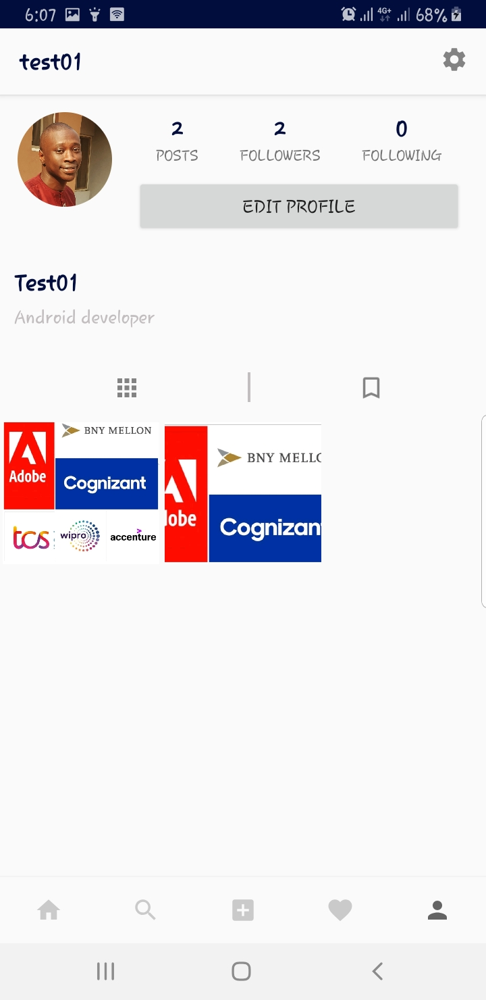

[](https://twitter.com/petprog)
# InstagramClone
Building an Instagram clone with Firebase and Kotlin while using some Jetpack libraries.


[](https://saythanks.io/to/mohak1283)

## Show some :heart: and star the repo to support the project.

## Note
This repository is still under development and I will continue to add more features to it.

## 💻 Requirements
* Any Operating System (i.e MacOS X, Linux, Windows)
* An IDE (Android Studio)
* A little knowledge on Android Jetpack

## Architecture
The architecture of this application relies and complies with the following points below:
* A single-activity architecture, using the [Navigation Components](https://developer.android.com/guide/navigation) to manage fragment operations.

## Libraries:
* [Navigation Component](https://developer.android.com/guide/navigation) to handle all navigations and also passing of data between destinations.
* [View Binding](https://developer.android.com/topic/libraries/view-binding/) allows you to more easily write code that interacts with views. Once view binding is enabled in a module, it generates a binding class for each XML layout file present in that module.

## Features

 * Custom photo feed based on who you follow
 * Post photo posts from camera or gallery
   * Like posts
      * View all likes on a post
   * Comment on posts
        * View all comments on a post
 * Search for users
    * Search screen showing all images except your own
    * Search based on usernames
 * Profile Screen
   * Follow / Unfollow Users
   * Change image view from grid layout to feed layout
   * Edit profile
 * Notification Screen
    * Notifications for likes, comments, follows, etc
    * Share images while chatting

## Screenshots

<p style="background-color:rgb(169,169,169);">





</p>
## Setup

1. You'll need to create a Firebase instance. Follow the instructions at https://console.firebase.google.com.
2. Once your Firebase instance is created, you'll need to enable anonymous authentication.

* Go to the Firebase Console for your new instance.
* Click "Authentication" in the left-hand menu
* Click the "sign-in method" tab
* Click "Google" and enable it


4. Enable the Firebase Database
* Go to the Firebase Console
* Click "Database" in the left-hand menu
* Click the Cloudstore "Create Database" button
* Select "Start in test mode" and "Enable"

5. Link Firebase to the app
* Create an app within your Firebase instance for Android, with package name com.app.demo
* Run the following command to get your SHA-1 key:

```
keytool -exportcert -list -v \
-alias androiddebugkey -keystore ~/.android/debug.keystore
```

* In the Firebase console, in the settings of your Android app, add your SHA-1 key by clicking "Add Fingerprint".
* Follow instructions to download google-services.json
* place `google-services.json` into `app/`.


# Upcoming Features
 -  Caching of Profiles, Images, Etc.
 -  Filters support for images
 -  Videos support
 -  Custom Camera Implementation
 -  Heart Animation when liking image
 -  Delete Posts
 -  Stories
 -  Send post to chats
 -  Chat Screen
 
 ## How to Contribute
 1. Fork the the project
 2. Create your feature branch (git checkout -b my-new-feature)
 3. Make required changes and commit (git commit -am 'Add some feature')
 4. Push to the branch (git push origin my-new-feature)
 5. Create new Pull Request